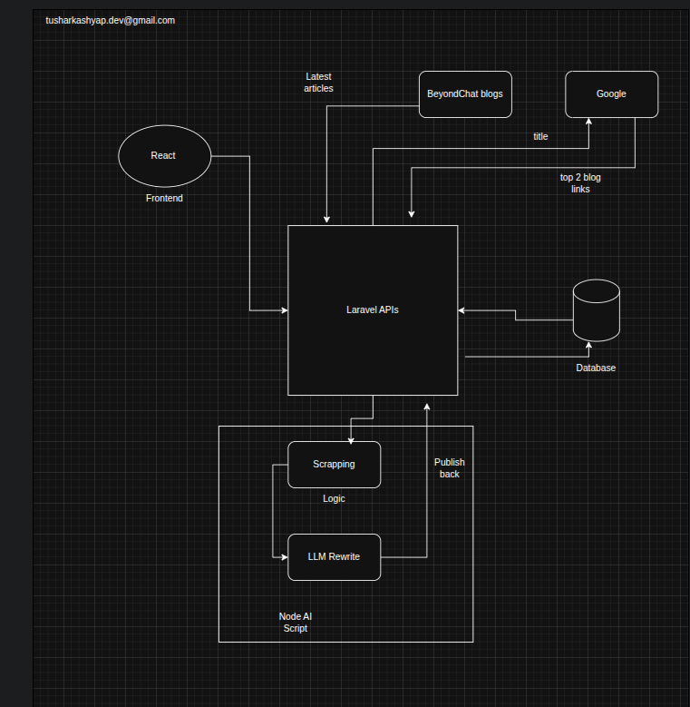
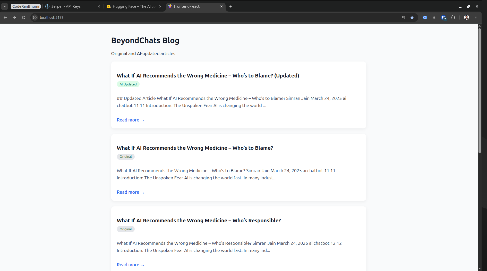
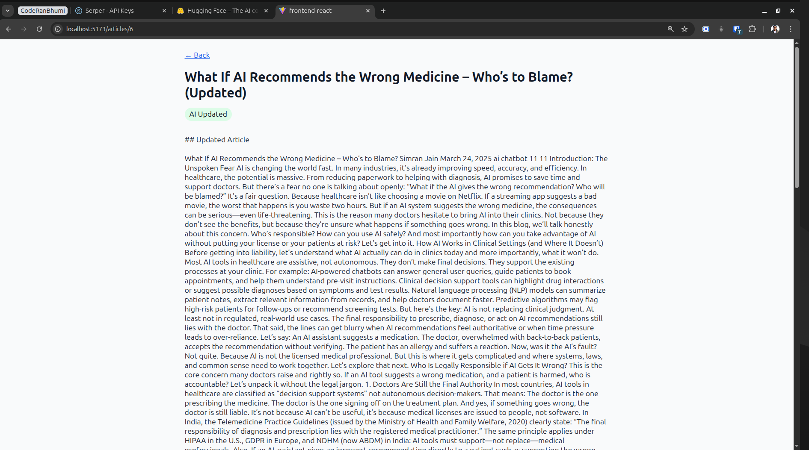

# AI-Powered Blog Enhancement System

This project is an end-to-end prototype built as part of an assignment to demonstrate web scraping, backend APIs, AI-assisted content enhancement, and frontend presentation.

The system scrapes blog articles from BeyondChats, stores them in a database, enhances selected articles using AI based on top-ranking Google articles, and displays both original and AI-updated articles in a React frontend.

---

## Project Architecture


## Phase 1 – Backend (Laravel)

### Features
- Scrapes the **5 oldest blog articles** from BeyondChats
- Stores articles in a database
- Exposes REST APIs for articles

### Tech Stack
- Laravel 11
- MySQL
- Symfony DomCrawler

### Scraping
Scraping is implemented as a Laravel Artisan command:

```bash
php artisan scrape:beyondchats
```

| Method | Endpoint             | Description          |
| ------ | -------------------- | -------------------- |
| GET    | `/api/articles`      | Fetch all articles   |
| GET    | `/api/articles/{id}` | Fetch single article |
| POST   | `/api/articles`      | Create article       |

## Phase 2 – AI Automation (Node.js)
### Purpose
The Node.js script automates content enhancement using AI.

### Flow

- Fetch latest article from Laravel API
- Search article title on Google
- Extract top-ranking competitor blog links
- Scrape competitor article content
- Rewrite original article using AI
- Publish updated article back to Laravel API
- Add references at the bottom

### Tech Stack
- Node.js
- Axios
- Cheerio
- Hugging Face Inference API (free tier)

### AI Model
- google/flan-t5-large (Hugging Face)

### Why Hugging Face?

- Free inference tier
- No billing required
- Suitable for text-to-text rewriting

### Error Handling

If the AI API is unavailable or rate-limited:
- The system gracefully falls back
- Cleaned original content is published
- Pipeline still completes successfully

# Phase 3 – Frontend (React)
### Features
- Lists all articles
- Clearly differentiates:
- Original articles
- AI-updated articles
- “Read More” functionality
- Responsive and clean UI

### Tech Stack

- React (Vite)
- Axios
- React Route

# Local Setup Instructions

```bash
git clone https://github.com/tusharharyana/ai-content-processing-system.git
```

## Backend (Laravel)

```bash
cd backend-laravel
composer install
cp .env.example .env
php artisan key:generate
php artisan migrate
php artisan serve
```
## AI Automation Script (Node.js)
```bash
cd ai-updater-node
npm install
cp .env.example .env
node index.js
```
## Frontend (React)

```bash
cd frontend-react
npm install
npm run dev
```

## Requirements
- Access token from 
https://huggingface.co/ as HF_API_KEY
- API key from https://serper.dev/ as SERPER_API_KEY

## UI Screenshots

